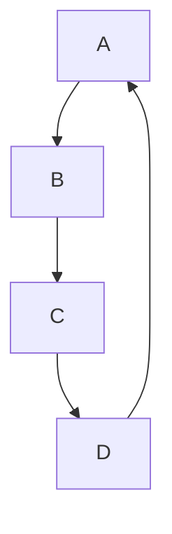

#Morden Java 01 <Java8>

## Functional Style Programming

#### Function이란? 
크게 두가지로 볼 수 있음 C언어의 입장에서 Function과 JAVA의 입장에서 Function 
- C언어 : 함수라고 부르는 main함수를 제외한 다른 함수 {} 블럭과 블럭 사이의 그거! 
``` 
int add(int a, int b){
    return a + b; 
}
int main(){
    int a = 10;
    int b = 10; 
    printf(" a + b : %d", add(a,b));
} 
```
(또한 절차적으로 진행이 됨)

-JAVA : 수학적 의미에서의 함수와 같음 `intput -> output`의 관계 `A -> 10 `이라는 함수가 있을 때 동일한 입력값에 대해서는
결과 값이 항상 같고 결과는 항상 1개인 관계 -> Side Effect가 없다(자판기)
 
 #### Immutablility (불변성)
 
- OOP(명령형) : `int n = 10;`이라고 되어 있는 상태에서 `n = 100;`으로 수정하였을 때 기존의 `int n = 10;`에서 10은 폐지가 되고 
  `n = 100;`으로 덮어쓰기가 된다. 
- Functional Programming(선언형) : `int n = 10;` 인 코드는 이를 정의하는 개념이라 한 번 정해진 값은 변하지 않는다(바꿀 수 없다?)
    그렇기 때문에 교체를 하는 방식으로 사용한다.


## 그래서 함수형 프로그래밍이 뭔데?
: `부수효과`를 없애고 `순수 함수`를 만들어 모듈화 수준을 높이는 프로그래밍 패러다임

`부수효과` : 주어진 값 이외의 외부 변수 및 프로그램 실행에 영향을 끼치지 않아야 된다는 의미 ==> 만족하는 함수를 `순수 함수`라고 함
```
private String name = "호랑이";

// not Pure
public String greeting(){
    return name + "어흥";
}

//Pure
public static String greeting(String name){
    return name + "어흥";
}
```

Stream API를 이용한 예시 ) 
```

List<String> myList = Arrays.asList("c1", "a2", "b3", "4", "5");

//기존 방식 데이터를 어떻게 처리할지 명령을 통해 풀어나감
for(int i = 0; i < myList.size(); i++){
    String s = myList.get(i);
    if(s.startsWith("c")){
        System.out.println(s.toUpperCase());
    }
}

//Stream API를 공부하진 않았지만 
// 선언적 함수를 통해 무엇을 풀어나갈지 결정 
myList.Stream()
    .filter(s -> s.startWith("c))
    .map(String :: toUpperCase)
    .forEash(System.out::println);
```
어떻게 보면 Stream으로 임시 타입 변경해서 메소드 떡칠 같은 느낌..

## 1급 객체란
> 특정 언어의 일급 객체(first-class citizens, 1급 값, 1급 엔티티, 1급 시민)이라 함은 컴퓨터 프로그래밍 언어 디자인에서 일반적으로 다른 객체들에 적용 가능한 연산을 모두 지원하는 객체를 가리킨다.   
> 
> 1급 객체(First class object)란 다음과 같은 조건을 만족하는 객체이다
> - `변수나 데이터 구조안에 담을 수 있다.`
> - `파라미터로 전달할 수 있다.`
> - `반환값(return valure)으로 사용할 수 있다.`
> - 할당에 사용된 이름과 관계없이 고유한 구별이 가능하다.
> - 동적으로 프로퍼티 할당이 가능하다.
> - 기존 데이터의 불변성

==> Java 8이후로 람다 표현식이 도입되어 이전보다 함수적인 스타일을 지원하기 시작 -> 메소드를 일급 객체처럼 다룰 수 있는 기능이 추가 

## 함수형 인터페이스 
- 1개의 추상 메소드를 갖는 인터페이스 
- java 8부터 인터페이스는 기본 구현체를 포함한 디폴트 메소드를 포함 할 수 있음 
- 여러개의 디폴트 메서드가 있더라도 추상 메서드가 오직 하나면 함수형 인터페이스임 
- 함수형 인터페이스는 선언시 명시적으로 어노테이션 (@FunctionalInterface)을 통해 함수형 인터페이스라는 것을 명시할 수 있다.  
  
```java
//함수형 인터페이스 예시 
@FunctionalInterface
interface MyRunnable{
    void run();
}

public class FunctionalTest implements MyRunnable{
    //함수형 인터페이스 구현체 
    @Override
    public void run() {
        System.out.println("Hello World");
    }
    public static void main(String[] args) {
       FunctionalTest test = new FunctionalTest();
       test.run();
    }
}

```
- 하지만 위의 구현체를 단발성으로 사용하고 싶을 때 위와 같이 생성하면 코드가 지저분해짐 
- 이것을 방지하고자 `익명 클래스`를 사용하기도 함


## 익명 클래스
- 이름이 없는 클래스
- 클래스의 정의와 동시에 인스턴스를 생성하여 사용함
- 인터페이스를 구현하거나 추상 클래스를 상속 받는 작은 구현체를 생성할 때 사용됨
```java
@FunctionalInterface
interface MyRunnable{ //함수형 인터페이스
    void run();
}

public class FunctionalInterfaceTest implements MyRunnable{
    @Override
    public void run() { // 함수형 인터페이스를 구현 구현체
        System.out.println("Hello World");
    }
    public static void main(String[] args) {
       FunctionalInterfaceTest test = new FunctionalInterfaceTest();
       test.run(); // 인터페이스 구현체 실행

       MyRunnable test2 = new MyRunnable() { //익명 클래스로 인터페이스 구현 
           @Override
           public void run() {
               System.out.println("Goodbye World");
           }
       };
       test2.run();

        MyRunnable test3 = ()-> System.out.println("Goodbye World"); //람다식으로 변경 

    }
}


```
  안드로이드 개발에서 부터 함수형 프로그래밍을 자주 사용하기 시작했다?  
  -> 기능별로 중점적으로 개발, 하지만 하나 하나 객체를 만들어서 따로 파일을 빼는 행위는 비효율적 -> 함수형 프로그래밍 도입 -> 아 근데 뭐 이렇게 기냐? -> 람다식 등장


## 람다 

- 람다는 무명 클래스로 메소드 하나짜리 객체를 매번 정의해야 하는 상황에서 태어남 
- (매개변수) -> {메소드 실행문} 이지만 
- 매개변수가 하나이면 소괄호 생략 가능
- 메소드 실행문이 return 한 문장이면 중괄호와 return 키워드 생략 가능


### 람다식 이해하기 

```java
//코드 내의 불필요한 (노이즈)를 제거한다고 생각하면 됨
new Comparartor<Product>(){
    @Override
    public int compare(Produnct p1, Product p2){
        return p1.getPrice().compareTo(p2.getPrice());
    }
};
// >>> 
(Product p1, Product p2){
    return p1.getPrice().compareTo(p2.getPrice());
}
// >>>
(Product p1, Product 2) -> {
    return p1.getPrice().compareTo(p2.getPrice());
}
// >>> 
(p1,p2) -> p1.getPrice().compareTo(p2.getPrice());

```
표현 방법
```java 
//1)
(User user) -> user.getName();
//>>
user -> user.getName();

//2)
()->"Unknown";

//3)
user->sout("Hello" + user);

``` 

```java
Arrays.sort(students,(o1,o2) ->{
    int num = 100; 
    //람다도 하나의 메소드라서 안에서 필요한 변수 만들어 쓰는건 OK
    sout("이름으로 정렬중!");
    student = new Student[10]; 
    // 이건 안돼 밖에 있는 데이터는 변경 X 
    //근데 또 클래스 멤버면 가능 , 객체 안에 계속 유지되는 변수 가능..
    return o1.getName().compareTo(o2.getName());
});
```


## Closure
- 클로저란 함수를 그 환경과 함께 저장한 레코드를 말함  
  *위키피디아
- 클로저는 함수와 그 주변 상태에 대한 참조 조합  
  *MDN문서 자바스크립트의 클로저


- `내부함수가 외부함수의 맥락(context)에 접근할 수 있는 것을 뜻한다.`
- 외부함수안에 있는 내부함수가 외부 함수의 지역 변수를 사용할 수 있는 것 
- 외부함수가 종료되도 내부함수에서 참조하는 외부함수의 context는 유지된다 
```java
int a = 3;
i -> i+a; 
```

### 자유 변수(free variable)
- 람다식 내에서 정의되지 않고, 또 파라미터로도 전달되지 않은 외부 Local variable를 참조하는 변수를 말한다.

```Java
public class Closure  {
    public static void main(String[] args) {
        int a = 3; // 자유변수
        Test test = new Test() {
            @Override
            public int run(int n) {
                //a = 2;  //에러
                return n + a;
            }
        };

        Test test = i -> i + a;
        System.out.println(test.run(11)); // 결과 14
    }

}

interface Test{
    int run(int n);
}

```


## Steam API

- 데이터의 연속
- System.in / System.out ) 스트림
- Collections.stream()을 제공
- filter, map, forEach 같은 고차함수(함수를 인자로 받는 함수) 제공
- Stream을 만들 때는 Stream.generate와 Steram.iterate로 만둘 수 있다
- Stream을 사용하면 연속된 데이터에 대해서 강력하고 풍부한 고차함수들을 사용하여 강력한 기능을 간결하게 표현할 수 있다.

==> 스트림을 이용하면 선언형(더 간결하고 가독성이 좋도록)으로 `컬렉션 데이터`를 처리할 수 있다.


```java
    //연속된 값임
    Stream.generate(()->1).forEach(System.out::println);

     // 0~200 사이 값 중에서 랜덤값 5개를 뽑아 순서대로 표시
        int [] arr = Stream.generate(()->rand.nextInt(100)+1) 
                .limit(5).sorted(Comparator.reverseOrder())
                .mapToInt(i -> i).toArray();

        System.out.println(Arrays.toString(arr));
```

stream은 `데이터 처리 연산`을 지원하도록 `소스`에서 `연속된 요소`로 정의할 수 있다.
- 데이터처리 연산
  - 스트림은 함수형프로그래밍 언어에서 일반적으로 지원하는 연산과 데이터베이스와 비슷한 연산을 지원 
  - 데이터를 순차적으로 또는 `병렬`로 실행할 수 있따.
  - filter, map, reduce, find, math, sort
- 소스
  - 스트림은 컬렉션, 배열, I/O 자원등의 데이터 제공 소스로부터 데이터를 소비한다.
  - 정렬된 컬렉션으로 스트림을 생성하면 정렬이 그대로 유지된다
    - 리스트로 스트림을 만들면 스트림의 요소는 리스트의 요소와 같은 순서를 유지한다.
- 연속된 요소
  - 컬렉션과 마찬가지로 스트림은 특정 요소 형식으로 이루어진 연속된 값 집합의 인터페이스를 제공
  - 컬렉션은 자료구조이므로 시간과 공간의 복잡성과 관련된 요소 저장 및 접근 연산이 주로 이룸
  - 스트림은 filter, map, sorted처럼 표현 계산식이 주를 이룸
  - 컬렉션의 주제는 `데이터` 
  - 스트림의 주제는 `계산`


### 스트림 사용 절차 
#### 1. 스트림 만들기 
- 배열 스트림 : Arrays.streeam()
- 컬렉션 스트림 : stream()
```java
List<String> list = Arrays.asList("A","B","C");
Stream<String> stream = List.stream();
```
#### 2. 중간 연산(가공하기)
- filtering : filter
  - 스트림 내 요소들을 하나씩 평가해서 걸래내는 작업, if문 역할
```java 
  List<String> list = Arrays.asList("a","b","c");
Stream<String> stream = list.stream()
	.filter(list -> list.contains("a"));
    // 'a'가 들어간 요소만 선택  [a]
```
- Mapping : map()
- 스트림 내의 요소들을 특정값으로 변환하는 작업
```java
    Stream<String> stream = list.stream()
	.map(String::toUpperCase);
	//[A,B,C]
    
    .map(Integers::parseInt);
    // 문자열 -> 정수로 변환
```
- Sorting : sorted()
- 스트림 내 요소들을 정렬 -> Comparator
```java
    Stream<String> stream = list.stream()
	.sorted() // [a,b,c] 오름차순 정렬
    .sorted(Comparator.reverseOrder()) // [c,b,a] (내림차순)
    
List<String> list = Arrays.asList("a","bb","ccc");
Stream<String> stream = list.stream()
	.sorted(Comparator.comparingInt(String::length)) // [ccc,bb,a] //문자열 길이 기준 정렬
```
- boxing : boxed()
- 프리미터? 애기 변수 - > 래퍼 변수
```java
.mapToInt(Student::getScore) //student 객체가 가진 score값으로 스트림 재생성.
			.boxed() //Integer 타입 Stream으로 변환.
			.forEach(score -> System.out.println(score));
```
#### 3. 최종연산(결과만들기) 

흠..아직 이해가..

## :: (더블클론, 이중 콜론 연산자)
- java 8 부터 사용가능
- 메소드 레퍼런스(메소드 참조 연산자)라고 불림 
- 람다식에서 파라미터를 중복해서 사용하고 싶지 않을 때 
- 람다식과 동일한 처리 방법을 갖긴 하지만 이름으로 기존 메소드를 참조함으로 더욱 보기 쉽게 사용가능..高

### 사용방법
```java 
 [인스턴스] :: [메소드명(or new)]
 ex ) User::gerId
 ```
1. 람다 표현식 `() -> {} `에서만 사용 가능 
2. static 메소드인 경우 인스턴스 대신 클래스 이름으로 사용 가능
   
### 예시
- 리스트를 순회하면서 대문자로 바꿔줄 때 
  ```java 
    List<String> testList = Array.asList("one","two","three","four");
    testList = tesList.stream()
    .map(a->a.toUpperCase())
    .collect(Collectors.toList());

    testList = testList
        .stream()
        .map(String::toUpperCase) // 이중 콜론 연산자 사용 
        .collect(Collectors.toList());

    public class TestDto {
    private Long id;
    private String name;
    }

    List<TestDto> testDtoList = new ArrayList<>();
    testDtoList.add(TestDto.of(1L, "첫번째"));
    testDtoList.add(TestDto.of(2L, "두번째"));

    // 람다 표현식
    testDtoList.stream().map(a->a.getId()).collect(Collectors.toList());
    // 이중 콜론 연산자 사용 
    testDtoList.stream().map(TestDto::getId).collect(Collectors.toList());
    //솔직히.. 람다식이.. ㅋㅋ
  ```
- static 메소드를 사용할 때 
```java
@Getter
@AllargsConstructor(staticName= "of")
public class NameDto {
	private String name;
}
    
List<String> testList = Arrays.asList("one", "two", "three", "four");
// 람다 표현식 
testList.stream().map(a->NameDto.of(a)).collect(Collectors.toList())
// 이중 콜론 연산자 사용 
testList.stream().map(NameDto::of).collect(Collectors.toList())
```


## Optional(맛보기) 
- Null Pointer Exception - 가장 많이 발생하는 에러중의 하나
- 자바에서는 (거의) 모든 것이 래퍼런스 ==> 모든 것이 null이 될 수 있다.
- 항상 null을 확인할 필요가 있다.


- null 쓰지말자 약속 : 계약한다 : 계약을 하고 프로그래밍 한다..?


## Optional 
- Optional이란  
  - java 에서 Optional<T> 클래스를 사용하해 NullPointException (이하`NPE`라고 하겠음)을 방지할 수 있도록 도와준다.
  - Optional<T> 는 Null이 올 수 있는 값을 감싸는 Wrapper 클래스로 참조하더라도 NPE가 발생하지 않도록 도와준다
  - Null이라도 바로 NPE가 발생하지 않는다
  - 클래스 이기에 각종 메소드를 제공해준다.
  
### Optional 사용법 
#### Optional 생성하기 
- 값이 Null인 경우) Optional.empty()
  - Optional은 Wrapper 클래스이기 때문에 값이 없을 수도 있음, 이때는 Optional.empty()로 생성 
  ```java
  Optional<String> optional = Optional.empty();

        System.out.println("Optional : " + optional); // Optional.empty
        System.out.println("optioanl.isPresent : " + optional.isPresent()); // false

  ```
  - Optional 클래스 내부에서 `static` 변수로 EMPTY 객체를 미리 생성해서 가지고 있음 -> 빈 객체를 여러번 생성해야하는 경우 메모리 절약 가능 
- 값이 Null이 아닌 경우) Optional.of()
  - 만약 어떤 데이터가 절대 Null이 아니라면 Optional.of()로 생성할 수 있다.
  - Optional.of()로 Null을 저장하려고 하면 NPE.. (그러면...왜 있는거야..?)
  - ```java
    //Optional<String> optioanl = Optioanl.of(); // 인텔리제이에서 컴파일 전에 오류
    Optional<String> optional = Optional.of("MyName");

        System.out.println("Optional : " + optional); // Optional[Myname]
        System.out.println("optioanl.isPresent : " + optional.isPresent());// true
  

- 값이 모호할 때(Null or !Null) Optional.ofNullable()
  - Optional.ofNullalbe로 생성할 수 있음
  - 이후에 orElse 또는 orElseGet 메소드를 이용해 값이 없는 경우라도 안전하게 값을 가져올 수 있음
- ```java
    class Person{
        String name;

        public Person(){}

        public String getName() {
            return this.name;
        }
    }
    public class testMain{
        public static void main(String[] args) {
            Person p = new Person();
            Optional<String> optional = Optional.ofNullable(p.getName());

            System.out.println("Optional : " + optional); // Optional.empty
            System.out.println("optioanl.isPresent : " + optional.isPresent()); // true
            String name = optional.orElse("없음"); // 값이 null 이면 "없음" 리턴
            System.out.println("name : " + name); // 없음
        }
    }

### 활용법
#### Optional 사용법 (1)
- 문제 : 
  - 기존에는 아래와 같이 null 검사를 한 후에 null일 경우에는 새로운 객체를 생성했다
- 해결 : 
  - Optional<T> 와 Lambda를 이용하면 간단 표현 가능!
```java
//java 8 이전
List<String> names = getNames();
List<String> tempNames = list != null 
    ? list 
    : new ArrayList<>();

// Java8 이후
List<String> nameList = Optional.ofNullable(getNames())
    .orElseGet(() -> new ArrayList<>());
```

#### Optional 사용법 (2)
- 문제 : 
  - 예를 들어 아래와 같은 우편번호를 꺼내는 null 검사코드가 있다고 가정
        
        ```java
        public String findPostCode() {
        UserVO userVO = getUser();
        if (userVO != null) {
            Address address = user.getAddress();
            if (address != null) {
                String postCode = address.getPostCode();
                if (postCode != null) {
                    return postCode;
                }
            }
         }
        return "우편번호 없음"
    
  - Optional 사용 
  - ```java 
    public String findPostCode() {
    // 위의 코드를 Optional로 펼쳐놓으면 아래와 같다.
    Optional<UserVO> userVO = Optional.ofNullable(getUser());
    Optional<Address> address = userVO.map(UserVO::getAddress);
    Optional<String> postCode = address.map(Address::getPostCode);
    String result = postCode.orElse("우편번호 없음");

    // 그리고 위의 코드를 다음과 같이 축약해서 쓸 수 있다.
    String result = user.map(UserVO::getAddress)
        .map(Address::getPostCode)
        .orElse("우편번호 없음");

#### Optional 사용법 (3)
```java
String name = getName();
String result = "";

try {
    result = name.toUpperCase();
} catch (NullPointerException e) {
    throw new CustomUpperCaseException();
}
//아래와 같이 수정 가능 가독성 up
Optional<String> nameOpt = Optional.ofNullable(getName());
String result = nameOpt.orElseThrow(CustomUpperCaseExcpetion::new)
                  .toUpperCase();
출처: https://mangkyu.tistory.com/70 [MangKyu's Diary:티스토리]
```
    
### 추가 Optional의 orElse와 orElseGet 차이 
- Optional의 단말 연산에는 OrElse와 orElseGet 메소드가 있음 
  - orElse : 파라미터로 값을 받음 
  - orElseGet : 파라미터로 함수형 인터페이스를 받음
  - ```java 
    public final class Optional<T> {

    ... // 생략

    public T orElse(T other) {
        return value != null ? value : other;
    }

    public T orElseGet(Supplier<? extends T> other) {
        return value != null ? value : other.get();
    }
  - orElse로는 값이, orElseGet으로는 .get()메소드가 넘어감 이로인해 호출 결과가 달라질 수 있음
  - 아래와 같은 코드는 어떻게 실행될까?
  - ```java 
    public void findUserEmailOrElse() {
    String userEmail = "Empty";
    String result = Optional.ofNullable(userEmail)
    	.orElse(getUserEmail());
        
    System.out.println(result);
    }

    public void findUserEmailOrElseGet() {
        String userEmail = "Empty";
        String result = Optional.ofNullable(userEmail)
            .orElseGet(this::getUserEmail);
            
        System.out.println(result);
    }

    private String getUserEmail() {
        System.out.println(getUserEmail()+"Called");
        return;
    }
  -   
  - orElse의 경우 
    1. Optional.ofNullable로 `EMPTY`를 갖는 Optioanl 객체 생성
    2. getUserEmail() 실행 반환값 orElse 파라미터로 전달
    3. orElse 호출 `EMPTY`가 Null이 아니므로 EMPTY 출력..
    >> Optional.orElse()가 값을 파라미터로 받고, orElse 파라미터 값을 넘겨주기 위해 getUseEmail()이 호출되었기 때문 
  - orElseGet의 경우
    1. Optional.ofNullabe로 `EMPTY`를 갖는 Optional객체 생성
    2. getUserEmail() 함수 자체를 orElseGet 파라미터로 전달
    3. orElseGet 호출 `EMPTY`가 Null이 아니므로 getUserEmail()호출 X  

## UUID 


  
    
[출처]


[YouTube](https://www.youtube.com/watch?v=lIEKOe0bh0M&t=10s/)

[T-story1](https://warpgate3.tistory.com/entry/%EC%9E%90%EB%B0%94%EC%BD%94%EB%93%9C%EB%A1%9C-%EB%B3%B4%EB%8A%94-%ED%95%A8%EC%88%98%ED%98%95-%ED%94%84%EB%A1%9C%EA%B7%B8%EB%9E%98%EB%B0%8D-Functional-Programming-in-Java/)

[T-stroy2](https://swiftymind.tistory.com/108/)

[T-story3](https://mangkyu.tistory.com/70 )


