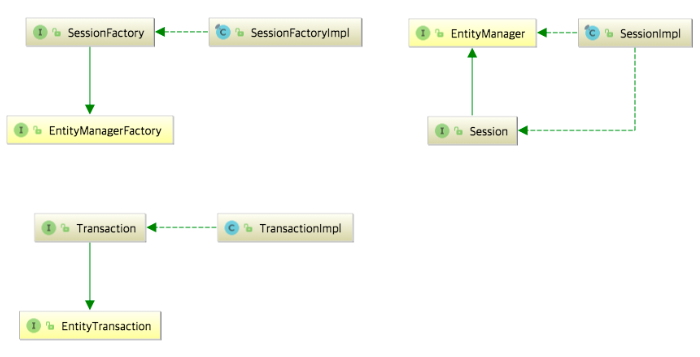
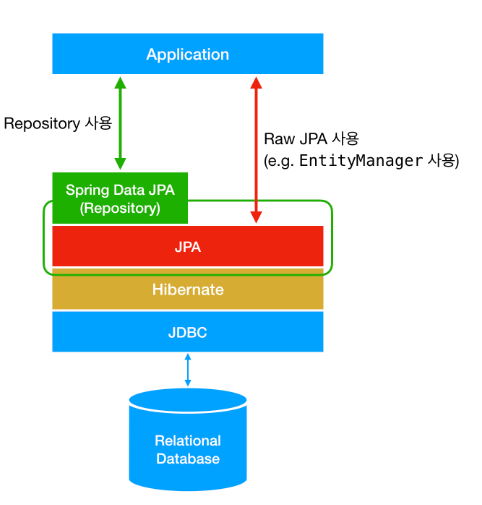

# [유뷰트] coding recipe 님 게시판 만들기 따라하기를 하며 궁금한 점 

## application.preproties 파일을 삭제했을 때 다시 생성하는 법 

### 해본 거
1. resorce에서 파일 -> 생성 -> application.preproties 이름으로 생성 
= 이름만 같고 그 스프링 나뭇잎 모양이 안나옴

2. resorce에서 파일 -> 생성 -> xml configuration file -> spring config -> application.preproties 이름으로 생성 
= 이름만 같고 그 스프링 나뭇잎 모양이 안나옴

## 실행하는데 테이블 생성이 안되던 문제  + log에 생성됐는지 안됐는지 안뜸
- application.yml
```java 
//application.yml
server:
  port: 8080

spring:
  application:
    name: springboot_mysql

  datasource:
    driver-class-name: com.mysql.cj.jdbc.Driver
    url: jdbc:mysql://localhost:3306/db_coding?serverTimezone=Asia/Seoul&characterEncoding=UTF-8
    username: user_coding
    password: 1234
  thymeleaf:
    cache: false

  jpa:
    open-in-view: true
    hibernate:
      ddl-auto: update
    //database-platform: org.hibernate.dialect.MySQL5InnoDBDialect
    //show-sql: true
```
- BoardEntity
```java
package org.example.springboot_mysql.entity;


import jakarta.persistence.*;

@Entity
@Table(name = "board_tb_jpa")
public class BoardEntity {
    @Id
    @GeneratedValue(strategy = GenerationType.IDENTITY)
    private long id;

    @Column(length = 30, nullable = false)
    private String writer;

    @Column
    private String title;
}

```

### 해본거 
1. 구글링 : 아래가 문제인 것 같은데 잘 모르겟음.. 
``` 
    HHH000204: Processing PersistenceUnitInfo [name: default]
    2024-08-29T02:31:59.100+09:00  INFO 53888 --- [springboot_mysql] [  restartedMain] org.hibernate.Version                    : HHH000412: Hibernate ORM core version 6.4.10.Final
    2024-08-29T02:31:59.133+09:00  INFO 53888 --- [springboot_mysql] [  restartedMain] o.h.c.internal.RegionFactoryInitiator    : HHH000026: Second-level cache disabled
```

2. 혼자 똥꼬쑈 하다가 재부팅하니까 됨.. 
3. 아직 로그는 안뜨는데 위에 
```java
   jpa:
    atabase-platform: org.hibernate.dialect.MySQL5InnoDBDialect
    show-sql: true
```
- yml 파일에 이거 추가했는데 될지 모르겠다.. 

### yml 파일에서 jpa : hibernate : ddl-auto : 
-create와 update의 차이가 뭘까 ?
- JAP 
  - java persistence API의 약자
  - 자바 app에서 관계형 DB를 사용하는 방식을 정의한 인터페이스 (진짜 interface임)
  - 라이브러리가 아님
- Hibernate 
  - JPA interface의 구현체임 
  - `javax.persistence.EntityManger`와 같은 인터페이스를 직접 구현한 라이브러리임
  - 
- Spring Data JPA
  - spring에서 제공하는 모듈 중 하나, 개발자가 JPA를 더 쉽고 편하게 사용할 수 있도록 도와줌 
  - JPA를 한 단계 추상화시킨 `Repository` 라는 인터페이슷 제공함 
  - 정해진 규칙대로 메소드를 입력하면 spring이 알아서 해당 메소드 이름에 `적합한 쿼리`를 날리는 구현체를 만들어서 Bean에 등록함
- 
- ddl-auto 
  - Entity만 등록해주면 `DDL(Data Defintion Language)`을 자동으로 작성하여 테이블을 생성, 수정해주는 설정 
  - create
    - 단어 그대로 Entity로 등록된 클래스와 매핑되는 테이블을 자동으로 생성
    - 과정에서 기존에 해당 클래스와 매핑되는 테이블이 존재한다면 기존 테이블을 삭제(drop)하고 생성 
  - create-drop
    - create와 비슷하게 Entity로 등록된 클래스와 매핑되는 테이블이 존재한다면 기존 테이블을 삭제하고 자동으로 테이블을 생성해줌
    - *에플리케이션이 종료될 때 삭제*
    - create table 후 drop table 한다고 생각하자  
  - update
    - Entity로 등록된 클래스와 매핑되는 테이블이 없으면 새로 생성
    - 기존 테이블이 존재한다면 테이블의 칼럼을 변경 
    - 일반적으로 생각하는 update와 달리 모든 변경사항을 반영하는 것은 아님
    - 기존에 존재하는 칼럼의 속성(nullabe, 크기, 테이터 타입 등)은 건드리지 않고 새로운 칼럼이 추가되는 변경사항만 반영 
    - ex ) String 필드를 int로 변경하더라도 해당 Entity에 매핑되는 테이블의 해당 칼럼은 int타입으로 바뀌지 않고 String 타입으로 유지됨 
  - validate
    - DDL을 작성하여 테이블을 생성하거나 수정하지 않음
    - Entity클래스와 테이블이 정상적으로 매핑되는지만 검사
    - 만약 테이블이 아예 존재하지 않거나, 테이블에 Entity의 필드에 매핑되는 칼럼이 존재하지 않으면 예외발생 
    - Entity 클래스의 필드가 매핑되는 테이블에 모두 존재하기만 한다면, 테이블의 칼럼이 더 많더라도 `아무 일도 일어나지 않는다`
  - none(default) 
    - none은 속성이 존재하는 것이 아님
    - 위의 4가지 경우를 제외한 모든 경우에 해당 
    - `아무 일도 일어나지 않는다.`
- on-in-view ? 
  