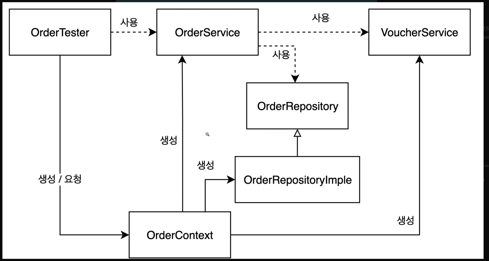
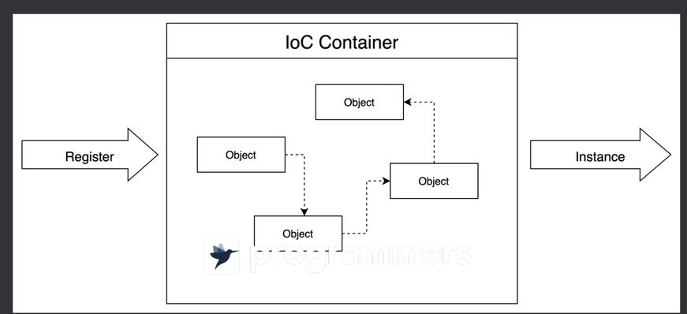
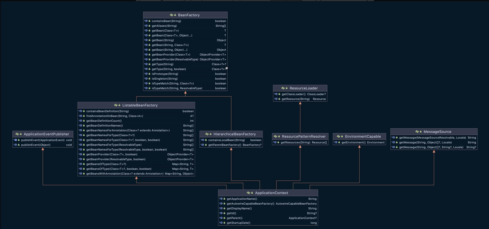
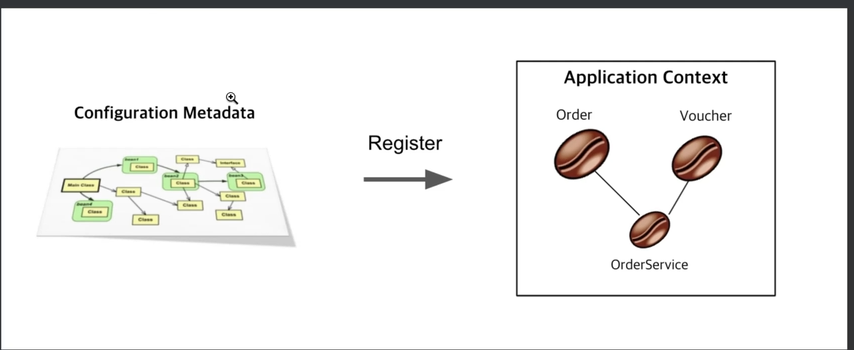

# spring 기본 개념 
 - spring은 여러 프로젝트로 구성되어 있는 자바 기반의 프로그래밍에 있어서 방대한 기능을 제공하는 Framework임
- spring  FrameWork
- sprint boot 
  - boot는 시스템을 사용 가능한 상태로 만드는 것을 의미 
  - SpringApplication을 통한 손쉬운 실행
  - Auto Configuration (bean 설정 자동화)
  - 쉬운 외부 화경 설정 - Properties, YAML, Commandline 설정

## MVC 구조
 - `Model`-`View`-`Controller`의 약자로 디자인 패턴의 일종
 - 비지니스 처리 로직과 사용자 인터페이스를 구분시켜 `서로 영향 없이 개발 가능`
 - `Model` : 무엇을 할지에 대해 정의 
   - 프로그램이 작업하는 세계관의 요소들을 `개념적`으로 정의한 것
   - 처리되는 데이터, 데이터 베이스, 내부 알고리즘 등 내부 비지니스에 관한 로직의 처리를 수행 --> 사용자에게 보이지 않는 로직 
   - 해당 도메인 세계를 얼마만큼 이해하고 있는지와도 밀접한 연관이 있음
   - 물리적인 요소뿐 아니라 추상적인 요소 또한 해당 작업을 수행하는데 특정 책임과 역할로서 구분 될 수 있다면 최대한 구체적으로 작은 `entitiy`를 유지하면서 `Model`설계하는 것이 중요하다.
 - `View` : 사용자에게 보여지는 영역, jsp등 사용자 인터페이스를 담당 
 - `Controller` : 모델에게 어떻게 할 것인지를 알려주며, `Model`과 `View` 사이를 연결하는 역할 사용자의 입출력을 받아서 데이터를 처리함 


# Domain Driven Design
- Entity
  : 엔터티는 다른 엔터티와 구별할 수 있는 식별자를 가지고 있고 시간에 흐름에 따라 지속적으로 변경이 되는 객체
  
- value Object
  : 값 객체는 각 속성이 개별적으로 변하지 않고 값 그 자체로 고유한 불변 객체 
    
  => 대체로 엔터티들이 벨류 오브젝트들을 가지고 있음.
- Domain
: 사용자가 어플리케이션을 사용하는 대상 영역 -> 비지니스 그 자체 ex ) 주문관리 어플이라면 주문이 도메인 

- dependency 
  : 어떤 객체가 협력하기 위해 다른 객체를 필요로 할 때 두 객체 사이의 의존성이 존재하게 된다. 의존성은 `실행 시점`과 `구현 시점`에 서로 다른 의미를 가진다.
  - 컴파일타임 의존성 (코드를 작성하는 시점 = `코드로 조지냐`): 
    - 코드를 작성하는 시점에서 발생하는 의존성. `클래스 사이의 의존성` 
  - 런타임 의존성 (코드를 실행 run 하는 시점 = `run할 때 객체 생성해서 조지냐`):
    - 애플리케이션이 실행되는 시점의 의존성. `객체 사이의 의존성` 
- 결합도 :
  하나의 객체가 변경이 일어날 때 `관계`를 맺고 있는 다른 객체에게 `변화를 요구하는 정도` 어떤 두 요소 사이에 존재하는 의존성이 바람직할 때 두 요소가 `느슨한 결합`도 또는 `약한 결합도`를 가진다고 말한다. 반대로 두 요소의 의존성이 바람직하지 못할 때 `단단한 결합도` 또는 `강한 결합도`를 가진다고 한다.  
  의존성이 바람직할 때 => `느슨한`, `약한` 결합도  
  의존성이 바람직 하지 않을 때 => `단단한`, `강한` 결합도
# IoC (Inversion of Controll : 제어의 역전)
- 처음에는 엔터티가 사용할 클래스를 결정하고 해당 클래스의 객체를 생성함 즉, `모든 종류의 작업을 사용하는 쪽에서 제어`  
- `제어의 역전이란` 객체가 자신이 사용할 개체를 스스로 선택하지않고 스스로 생성도하지 않는다.  
- `라이브러리`를 사용하는 애플리케이션 코드는 `애플리케이션 흐름`을 직접 제어
- `프레임워크`는 거꾸로 애플리케이션 코드가 프레임워크에 의해 사용됨 -> 프레임워크가 흐름을 주도하면서 개발자가 만든 애플리케이션 코드를 사용함
- 정리 : 애플리케이션 코드가 프레임워크가 짜놓은 `틀`에서 수동적으로 동작함 이를 `Hollywood Principle`이라고 함
- 

# Application Context
 - 일종의 IoC Container
- `IoC 컨테이너`는 객체에 대한 생성과 조합이 가능하게 하는 프레임워크이다. 
- 
- Spring에서는 IoC 컨테이너를 ApplicationContext 인터페이스로 제공함 
- 
- `Bean` 스프링(IoC)이 관리하는 객체 `@Bean`으로 관리
- 스프링의 ApplicationContext는 실제 만들어야할 빈 정보를 `Configuration Metadata(설정 메타데이터)`를 이용해서 IoC 컨테이너에 의해 관리되는 객체들을 생성하고 구성한다. -> 에플리케이션에서 객체들의 도면이라고 볼 수 있음
- 
# DI(Dependency Injection)
- IoC는 다양한 방법으로 만들 수 있다.
  - 전략 패턴
  - 서비스 로케이터 패턴
  - 팩토리 패턴
  - 의존관계 주입 패턴
- 지금까지 Order가 어떤 Voucher객체를 생성할지 OrderService가 어떤 OrderRepository객체를 생성할지 `스스로 결정하지 않고 생성자`를 통해서 객체를 주입 받는 패턴을 `생성자 주입 패턴(DI)`라고 함 
- 그 외에 스프링은 세터 기반의 의존관계 주입도 지원함 

# Model (객체)
 ## Model 이란 : 
  - 스프링 프레임워크에서 Model은 MVC아키텍처에서 View와 Controller 간의 `데이터 전달`을 담당하는 `객체`이다. 
  - Model 객체는 비지니스 로직의 결과를 담아서 View에 전달하거나, 사용자 입력을 받아서 Controller에 전달하는 역할을 함
  - Model은 일반적으로 key-value 쌍의 컨테이너로 사용됨 
  - Controller 에서 데이터를 Model에 저장하고, 이를 View에 전달하여 `동적`으로 생성되는 웹페이지를 생성함
  - Model을 사용하여 데이터를 전달하는 가장 일반적인 방법은 View에서 해당 데이터를 표시하거나 사용하는 것임 
 ## 사용법 :
   : 스프링에서 Model 객체를 생성하고 사용하는 방법은 여러가지가 있음  
  

- 일반적으로 SPring MVC에서는 Controller의 메소드 매개변수에 Model인스턴스를 선언하여 사용 
- 스프링은 이 인스턴스를 자동으로 생성하고 `Controller 메소드 실행전에` 전달
```java 
  @Controller
  public class MyController{
    
    @GetMapping("/hello")
    public String hello(Model model){
      String msg = "hello"
      model.addAttribute("mgs",message);
      //key-value 쌍으로 저장 key : "msg" value : "hello"
      return "helloPage";
      // 뷰 템플릿 반환
    }
  }
```
- "helloPage" 라는 뷰 템플릿을 반환하는데 이 뷰 템플렛에서는 Model에 저장된 데이터를 사용하여 동적으로 페이지를 생성하거나 표시할 수 있음 

```html
<!DOCTYPE html>
<html>
  <head>
    <title>helloPage</title>
  </head>

  <body>
    <h1>welcome</h1>
    <p>${msg}</p>
  </body>
</html>
```
- 뷰 템플릿에서는 `${msg}` 표현식을 사용하여 Model에 저장된 데이터를 사용할 수 있음
- 위의 예시에서 "hello"라는 메세지가 웹 페이지에 표시됨 


## lombok
: 생성자, getter, setter 자동으로 생성해주는 녀석인듯?

- @RequiredArgsConstructor 
  - `final`이 붙은 필드만 생성자를 자동으로 생성해주는 어노테이션